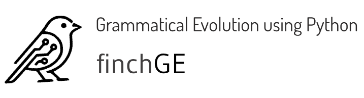

 
# FinchGE: A Modular Grammatical Evolution Library
 
[](https://pypi.org/project/finchge/)
[](https://pypi.org/project/finchge/)
[](https://opensource.org/licenses/MIT)
[](https://finchge.readthedocs.io/)
[](https://github.com/finchGE/finchge)
[](https://github.com/finchGE/finchge/actions)

 

 


A modern, flexible, and powerful Python framework for Grammatical Evolution.

**finchGE** is an evolutionary algorithm toolkit that evolves solutions using a grammar-based approach. Unlike traditional genetic programming, it uses a genotype-to-phenotype mapping system driven by formal grammars, enabling users to easily evolve structured programs, expressions, or models in domains such as symbolic regression, AI, and optimization.

## Why finchGE

 
- Modular and extensible: Plug-and-play mutation,  election, fitness, and search strategies.
- Designed for research and industry: Convenient and flexible API for quicker implementation.

## Quick Example

Using **finchGE** is straightforward.

Step 1. Define grammar

```python
grammar_file = "grammar.bnf"
grammar = BNFGrammar.from_file(grammar_file)
``` 

Step 2. Define a Fitness Evaluator ; `fitness_evaluator`

```python

fitness_evaluator = FitnessEvaluator(fitness_functions=fitness_fn, training_required=False)

```
 
Step 3. Create `GrammaticalEvolution` instance and run

```python
       ge_ = GrammaticalEvolution(fitness_evaluator=fitness_evaluator)

```

For further details, please check. Getting Started and API documentation
 
 


## References

- Michael O'Neill and Conor Ryan, "Grammatical Evolution: Evolutionary Automatic Programming in an Arbitrary Language", Kluwer Academic Publishers, 2003.
- Fenton, M., McDermott, J., Fagan, D., Forstenlechner, S., Hemberg, E., and O'Neill, M. PonyGE2: Grammatical Evolution in Python. arXiv preprint, arXiv:1703.08535, 2017.